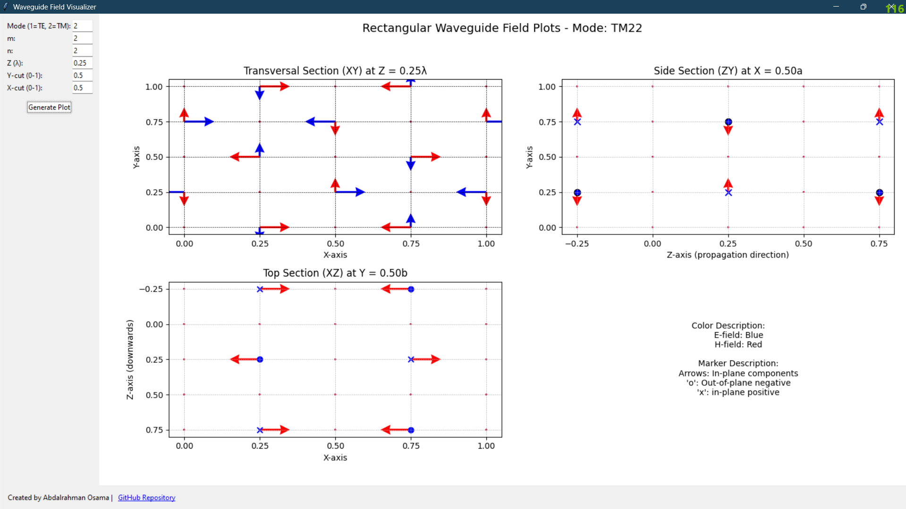

# Waveguide Field Visualizer



A Python application for visualizing electromagnetic field patterns in rectangular waveguides, supporting both TE and TM modes.

## Features
- 2D visualization of electromagnetic fields
- Transversal (XY), Top (XZ), and Side (ZY) section views
- Adjustable mode indices (m, n)
- Configurable cross-section positions
- Vector field normalization for clear visualization

## Requirements
- Python 3.6+
- numpy
- matplotlib
- tkinter

## Installation
```bash
git clone https://github.com/AbdalrahmanOsama001/Waveguide-Field-Visualizer.git
cd Waveguide-Field-Visualizer
pip install -r requirements.txt
```

## Usage
1. Run `python RectangularWaveguidePlotter.py`
2. Input parameters:
   - Mode: 1 for TE, 2 for TM
   - Mode indices m and n (positive integers)
   - Z position (in wavelengths)
   - Cross-section positions (0-1 values)
3. Click "Generate Plot" to update visualizations

## Documentation
The application provides four simultaneous views:
1. **Transversal Section (XY):** Field patterns in waveguide cross-section
2. **Top Section (XZ):** Longitudinal view with vertical field components
3. **Side Section (ZY):** Longitudinal view with horizontal field components
4. **Legend:** Color and marker explanations

## Credits
Developed by [Abdalrahman Osama]  
Contact: [abdalrahmanosama01@gmail.com]  
[GitHub Repository](https://github.com/yourusername/Waveguide-Field-Visualizer)

## License
MIT License - See LICENSE file
